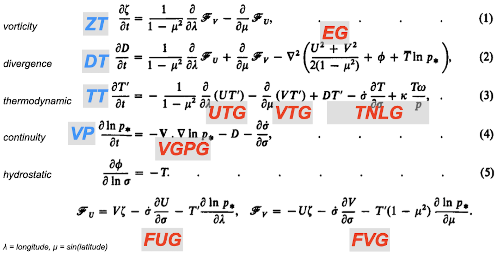
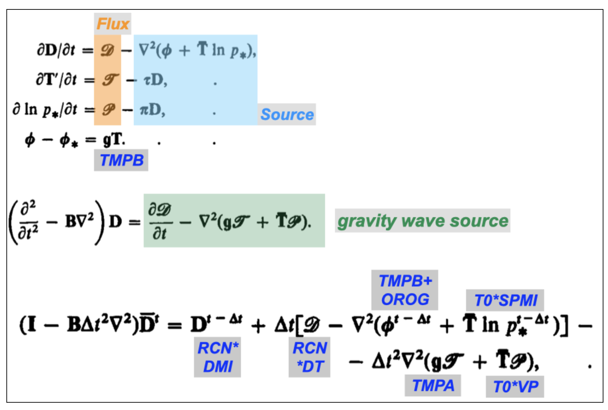
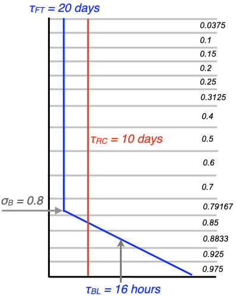

# Appendix A: DREAM Works - Model Code Basics and Data Structure

---
## A.1 Compilation on your system
Now The primitive equations and the semi-implicit timestep
DREAM solves the primitive equations expressed in terms of vorticity and divergence. These are written down in Hoskins and Simmons (1975, HS75) but let’s deciphier this presentation by approaching  them from the momentum equations, using subscript notation for partial derivatives:

$$
   \begin{eqnarray}
      u_t - fv &=& -uu_x - vu_y -wu_z - p_x/\rho & \qquad\qquad (A1) \\
      v_t + fu &=& -uv_x - vv_y -wv_z - p_y/\rho & \qquad\qquad (A1) \\
   \end{eqnarray}
$$

then,

$$
   \begin{equation}
      \dfrac{\partial}{\partial x} (A2) - \dfrac{\partial}{\partial y} (A1)
   \end{equation}
$$
gives the vorticity equation:

$$
   \begin{equation}
      \xi_t + f D + \beta v = -u\xi_x - v\xi_y - \xi D - (wv_z + p_y/\rho)_x + (wu_z + p_x/\rho)_y
   \end{equation}
$$
which leads to an equation for the tendency of absolute vorticity:

$$
   \begin{equation}
      \frac{\partial\zeta}{\partial t} = \frac{\partial}{\partial x} \{-u\zeta - wv_z - p_y/\rho\} - \frac{\partial}{\partial y} \{-v\zeta - wu_z - p_x/\rho\}
   \end{equation}
$$

The terms in curly brackets can be designated by the vector $(F_u,F_v)$ and this vorticity equation is the curl of this vector. Likewise the tendency of the divergence  can be deduced from the momentum equations:

$$
   \begin{equation}
      \dfrac{\partial}{\partial x} (A1) - \dfrac{\partial}{\partial y} (A2)
   \end{equation}
$$
eventually leading to a divergence equation as another expression in $F_u$ and $F_v$  with an added source related to the kinetic energy.

$$
   \begin{equation}
\frac{\partial D}{\partial t} = \frac{\partial}{\partial x} F_u + \frac{\partial}{\partial y} F_v - \frac{1}{2}\nabla^2(u^2 + v^2).
   \end{equation}
$$

These equations are written in sperical coordinates in HS75 and thermodynamic, continuity and hydrostatic equations are added in sigma vertical coordinates as shown in fig. A1. Also shown in Fig. A1 are some of the variable names used in the model for these terms: spectral variables in blue and grid point variables in red. In these equations $T'$ is a temperature deviation from a reference value which in DREAM is just set to 250K, $p*$ is the surface pressure, which in DREAM is calculated as the mean sea level pressure, and $\phi$  is the geopotential. The divergent part of the flow, expressed in equations 2-5 in fig. A1, can be written in summary form as a set of tendencies generated by flux convergences and other source terms. Eliminating for the divergence $D$ gives a wave equation in  with a source term. The semi-implicit time stepping approach is used to filter these gravity waves, by discretising this equation so that  the wave equation operator acts on the centred average divergence $\overline{D}$ , effectively filtering the fast gravity modes and allowing a longer time step. This development is summarised in fig. A2, including some more variable names from the code.

_Fig. A1: The primitive equations as presented in HS75._

_Fig. A2: Some more equations culled from HS75, outlining the semi-implicit timestep._

---
## A.2 Spectral truncation and data organisation
The model proceeds by calculating tendencies and then applying these tendencies to the model state to find the next model state using a semi-implicit centred difference timestep. Linear calculations for the tendencies are carried out directly in spectral space. Spatial derivatives are calculated as part of the transformation between spectral and grid space. Nonlinear advective terms are calculated in grid space. Model state variables therefore have both spectral and gridpoint arrays asigned to them, and in this section we will briefly outline how this data is organised. 

Model variables are projected onto Fourier transforms in the zonal direction and Legendre polynomials in the meridional direction. 

$$
   \begin{equation}
      X = \sum X^m_n P^m_n(\mu)e^{im\lambda}
   \end{equation}
$$

where $m$ is the zonal wavenumber, and n is the meridional wavenumber (i.e. the number of zeros between the poles). The number of coefficients is limited by a “jagged triangular” truncation, which has the property of istoropy on a sphere (the resolution independent of direction or latitude), and equal numbers of even and odd coefficients with respect to symmetry about the equator, in total and also individually for each zonal wavenumber. This is illustrated in fig. A3 which shows how many coefficients you have for triangular truncation to an odd number, T5 and an even number T4. DREAM can easily be run at T31 or T42.

_Fig. A3: Jagged triangular truncation for spectral coefficients._

For each model level, these complex coefficients are stored in increasing values of the meridional index n, embedded within increasing values of zonal wavenumber m. But this is done separately for even and odd coefficients. So for example, referring to fig. A3, the divergence, temperature and pressure variables at T5 would be stored in the following order: EEE,EE,EE,E,E,OOO,OO,OO,O,O. This data organisation makes it easy to create a state that is symetric about the equator: you just set all the odd coefficients (the second half of the binary record) to zero. This works because these fields are naturally symmetric about the equator (one does not expect divergence or temperature to change sign on the eqator). To make it work in the same way for the absolute vorticity, which is naturally antisymmetric, the vorticity coefficients are stored in the oppostie order: OOO,OO,OO,O,O,EEE,EE,EE,E,E. The jagged triangular truncation also provides a rapid way to impose cyclic symmetry in the zonal direction by selecting m as a  multiple of the order of symmetry desired. Six-fold symmetry was used in the original baroclinic wave lifecycle experiments (Simmons ans Hoskins, 1978), but this feature has not yen been used with DREAM. 

When the model variables are transformed to grid space they are stored on a Gaussian grid in latitude pairs, closing in towards the equator from the most polar latitudes to the most equatorial. There are MG equally spaced longitude points around the globe, with the first one situated on the Greenwich meridian. And there are JG different latitudes in each hemisphere, situated between the pole and the equator. Grid data is written for a given level in the following order: 

* first latitude pair:
`j=1 (north): i=1,MG, 0,0, j=JGG (south): i=1,MG,0,0`
* second latitude pair
`j=2 (north): i=1,MG, 0,0, j=JGG - 1 (south): i=1,MG,0,0`
* and so on until final latitude pair (closest to the equator)
`j=JG (north): i=1,MG, 0,0, j=JG + 1 (south): i=1,MG,0,0`.

Note that the total number of latitudes `JGG=2JG`, and two dummy zeros are written per latitude so the longitiude index in the array is actually `MGG=MG+2`. 

Gridpoint operations are carried out one latitude-pair at a time for all levels. So at any given moment only one latitude pair exists in grid space. The calculations proceed in zonal-vertical  slices. Note that in some routines the data is in grid space in the meridional direction but in Fourier coefficients in the zonal direction. At this stage the data is still complex, but when the data is fully into grid space it is real. Real grid data shares array space in common blocks with hybrid latitude-Fourier data, so declarations can change from one subroutine to another with the same variable names. Eeek !

---
## A3.  Model variables and dimensions

The basic model variables are vorticity and divergence (s$^{-1}$), temperature (degrees C), surface pressure (Pa) and specific humidity (kg/kg). These quantities are non-dimensionalised using physical constants:

* __Time__: the angular velocity of the earth `WW`=$\Omega$=2$\pi /$23.93 $\times$ 3600$ ($^{-1}$).  This immediately gives a scaling for vorticity and divergence, giving model variables: 
    -  `Z = Absolute vorticity / WW`
    -  `D = Divergence / WW`

* __Distance__: the radius of the earth `RADEA`=$a$ = 6371000 m
This gives us a scaling for __Speed__: `CV =RADEA*WW`
so in grid space `UG` and `VG` equal $u$ and $v$ divided by `CV`.

* __The gas constant__: `GASCON`=$R$ = 287 J/(kg K) or m$^2$/(s$^2$ K).
This gives us a scaling for temperature `CT=CV*CV/GASCON`. 
The temperature variable used in the model is thus 
`T = (Temperature in Kelvin - 250) / CT`.

The surface pressure appears in the model equations as `SP=ln(p*)`. Since DREAM does not have explicit orography, this `p*` is actually the mean sea level pressure referenced to 1000 hPa. This is calculated from the temperature and the geopotential height at 1000 hPa according to :

$$
   \begin{equation}
      \ln (p_* / 1000) = \left(\frac{gz}{RT}\right)
   \end{equation}
$$

* Specific humidity `Q` is already dimensionless as kg of water vapour per kg of air. 

* Other physical constants set and used in the model are:
    - Gravitational acceleration `GA`=$g$= 9.81 m$^2$/s$^2$,
    - The ratio of the gas constant to the specific heat capacity at constant pressure `AKAP` =$\kappa=R/Cp$ =  0.286,
    - The latent heat of condensation `RLHEAT`$=L = 2256476$ J/kg

Special attention needs to be paid to the nondimensionalisation of time intervals, timescales and rates. Since time is nondimensionalised in terms of an angular frequency $\Omega$, this means that a non-dimensional day actually has a day length of 2$\pi$. So if a timescale is specified in days, for example the dissipation timescale in the free troposphere `TAUFT=20 days`, then it’s non-dimensional value will be 20 $\times$ 2. The associated dissipation rate `FTFR` is the reciprocal of this: `FRFT=1./(PI2*TAUFT)` . Note that timescales are generally specified as `TAUXX (days)` and the associated rates as `FRXX`. The same logic applies to the nondiensional length of the model timestep `DELT=PI2/TSPD (=2*PI/64)`. For details of the reporting of time in model output and data see section 7. 

---
## A4. Vertical structure
DREAM currently uses 15 $\sigma$-levels in the vertical. They are referenced to the mean sea level pressure, as calculated from temperature and pressure at the 1000 hPa level as shown above. So model levels in DREAM are quite close to pressure levels, because there is no explicit orography. This does not mean that there is no orographic forcing in the model, because the absence of explicit orography is compensated for automatically in the empirical forcing of momentum. But it does mean that DREAM cannot simulate the interaction of transient systems with orography, because our empirical forcing is not flow-dependent. 

The sigma levels used in DREAM have been chosen to be as close as possible to the ECMWF standard pressure levels on which the data was originally provided, minimising interpolation errors. An exact correspondence is not possible because the model sigma levels must fall at the mid point of model sigma layers. It is, in fact, the boundaries between sigma layers that are specified, not the mid-points. The layer boundaries start at zero at the top of the atmosphere and finish at unity at the bottom. Sigma levels are then calculated as the mid-points between these layer boundaries. The layer boundaries in DREAM have been chosen so that we end up with model sigma levels centred at the following fifteen values: 

 $\sigma \times$ 1000 = 37.5, 100,150, 200, 250, 312.5, 400, 500, 600, 700, 791.67, 850, 883, 925, 975

The model uses the Simmons and Burridge (1981) angular momentum conserving vertical scheme. The term “vertical scheme” refers to the way in which the geopotential is calculated on sigma levels in the gravity wave source term shown in fig. A2. For a quick discussion of this see the appendix of Hall (2000). 

---
## A5. Dissipation
Scale selective hyperdiffusion is applied in spectral space to all the model’s 3-d state variables (`Z`,`D`,`T`,`Q`) independently of vertical level. Any order of the Laplacian operator can easily be used because it reduces to a simple multiple of the spectral coefficients. A timescale is also specified. Currently the default horizontal diffusion is set to 12-hour $\Nabla^6$ . 

Further level-dependent vertical diffusion and damping is added in grid space to all 3-d state variables (`U`,`V`,`T`,`Q`). Linear diffusive vertical fluxes are calculated from vertical gradients at sigma-level boundaries. Their convergence is then calculated at sigma levels, using linear centred differences. The boundary conditions act to damp the system as if the top and bottom surfaces mirrored the reference value in the adjacent layer, like a sponge at the top of the atmosphere or a fixed SST at the surface. The timescales used to calculate the fluxes depend on the model level, and are much shorter at the lowest levels. The damping rate (the reciprocal of the time scale) follows a linear profile from the surface to a specified boundary layer height. Standard parameters are shown in fig. A4. The mean rate in the boundary layer corresponds to a time scale of 16h. There is an optional doubling of the lowest layer vertical diffusion coefficient over land if `LLSD` is to to true. This is currently enabled by default at T42 but disabled at T31. Above the boundary layer, in the free troposphere, the vertical diffusion rate is fixed with a default timescale of 20 days. 

In addition to difusion, there is a level-indepenent linear damping on temperature only, with default time scales of 10-days (T31) and 12-days (T42). This is intended as the crudest radiation scheme imaginable. In principle, simple in-situ linear damping like this could be added either in spectral or grid space. On the other hand, the vertical diffusion must take place at a geographical location in grid space. There is an option to vary the boundary layer coefficient as a function of latitude, with a different value at the equator that smoothly approaches the standard extratropical value at specified latitudes. Finally there is the optional uniform damping applied to all degrees of freedom in spectral space. This is only indended for use in stabilising fixed basic states. 

The empirical forcing always acts hand in hand with the prescribed dissipation. Whenever a damping or diffusion parameter is changed, the forcing must be recalculated. If you find you are tinkering a lot with the dissipation parameters for simple GCM runs, but you don’t want to go through the long process of finding a new `_fcm` forcing every time you make an adjustment, there is a short cut. If the dissipation is linear, the transient eddy part of the forcing: `fbs-fcm` will not change. And it is quick to find the forcing for a fixed basic state _fbs. So if you want, you can calculate the transient forcing just once, and then go ahead and subtract it from a newly calculated `_fbs` forcing every time you change parameters.  This will give you a new _fcm every time, which should be identical to the `_fcm` you would have calculated the long way by stepping through lots of inital conditions. For this to work your basic state must of course be the mean of your long dataset. See Appendix B for a mathematical explanation. 

_Fig. A4: Vertical profiles of diffusion and damping with associated time scales._

---
## A6. Code structure

Most of the presentation of the code is in Appendix D, but here I will walk you through the main program to give you an idea of how one timestep unfolds. Have the source code open in front of you while you read this. 

i) Model setup
A few subroutines are called to set up things that are not going to change thoughout the model run. INISET to set up namelist variables, nondimensionalisation constants and factors for Fourier transforms etc. INIGAU calculates Gaussian weights and latitudes. INISI sets up sigma levels, the vertical scheme and the semi-implicit scheme. INIRES defines damping coefficients from timescales given in the namelist. INIVAR initialises some model variables such as grid point fields, masks etc, and initialises the spectral state variables to zero. 

ii) The training loop
The loop from 1 to KTFIN starts next and is bounded by line number 111. It is only used for training runs (LTRAIN=.T.). It actually runs the model multiple times for one timestep from a sequence of initial conditions. 

iii) Initialisation
State variables are reinitialised to zero for good measure, and then read from the input data in INIIC. Then if necessary we skip through the reference data and cyclic forcing files to the correct calendar date to get ready to read in the basic forcing. READFCE reads the forcing and reference data and then, conditionally on options set in the namelsit we read the forcing anomly, nudging data and SST data. 

Once this is all done the intial condtion is written out as the first record of the model’s spectral history file at RKOUNT=0. For consistency in the number of records per file, gridpoint history records are also output at this point. But the first record of the grid history file will only contain the intial zeros, because no gridpoint information has yet been calculated. 