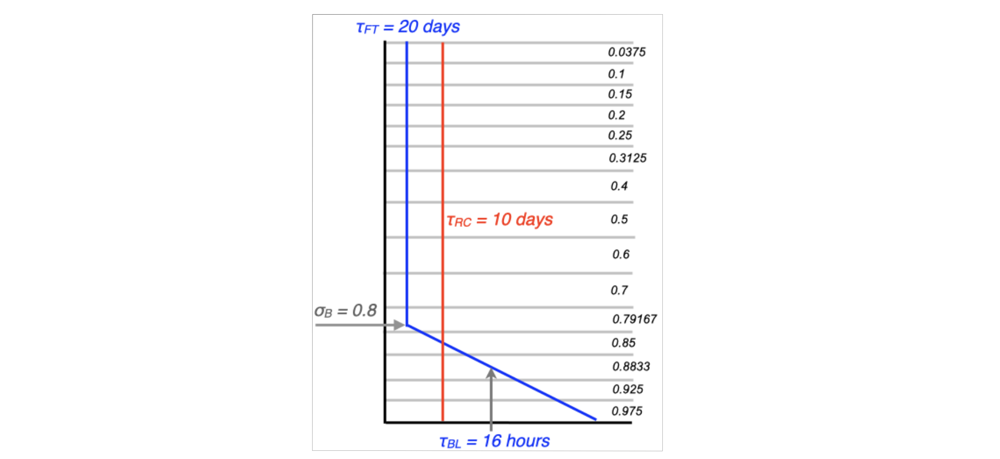

# Appendix A: DREAM Works - Model Code Basics and Data Structure

---
## A.1 The primitive equations and the semi-implicit timestep

DREAM solves the primitive equations expressed in terms of vorticity and divergence. These are written down in Hoskins and Simmons (1975, HS75) but let’s deciphier this presentation by approaching  them from the momentum equations, using subscript notation for partial derivatives:

$$
   \begin{eqnarray}
      u_t - fv &=& -uu_x - vu_y -wu_z - p_x/\rho & \qquad\qquad (A1) \\
      v_t + fu &=& -uv_x - vv_y -wv_z - p_y/\rho & \qquad\qquad (A1) \\
   \end{eqnarray}
$$

then,

$$
   \begin{equation}
      \dfrac{\partial}{\partial x} (A2) - \dfrac{\partial}{\partial y} (A1)
   \end{equation}
$$
gives the vorticity equation:

$$
   \begin{equation}
      \xi_t + f D + \beta v = -u\xi_x - v\xi_y - \xi D - (wv_z + p_y/\rho)_x + (wu_z + p_x/\rho)_y
   \end{equation}
$$
which leads to an equation for the tendency of absolute vorticity:

$$
   \begin{equation}
      \frac{\partial\zeta}{\partial t} = \frac{\partial}{\partial x} \{-u\zeta - wv_z - p_y/\rho\} - \frac{\partial}{\partial y} \{-v\zeta - wu_z - p_x/\rho\}
   \end{equation}
$$

The terms in curly brackets can be designated by the vector $(F_u,F_v)$ and this vorticity equation is the curl of this vector. Likewise the tendency of the divergence  can be deduced from the momentum equations:

$$
   \begin{equation}
      \dfrac{\partial}{\partial x} (A1) - \dfrac{\partial}{\partial y} (A2)
   \end{equation}
$$
eventually leading to a divergence equation as another expression in $F_u$ and $F_v$  with an added source related to the kinetic energy.

$$
   \begin{equation}
\frac{\partial D}{\partial t} = \frac{\partial}{\partial x} F_u + \frac{\partial}{\partial y} F_v - \frac{1}{2}\nabla^2(u^2 + v^2).
   \end{equation}
$$

These equations are written in sperical coordinates in HS75 and thermodynamic, continuity and hydrostatic equations are added in sigma vertical coordinates as shown in fig. A1. Also shown in Fig. A1 are some of the variable names used in the model for these terms: spectral variables in blue and grid point variables in red. In these equations $T'$ is a temperature deviation from a reference value which in DREAM is just set to 250K, $p*$ is the surface pressure, which in DREAM is calculated as the mean sea level pressure, and $\phi$  is the geopotential. The divergent part of the flow, expressed in equations 2-5 in fig. A1, can be written in summary form as a set of tendencies generated by flux convergences and other source terms. Eliminating for the divergence $D$ gives a wave equation in  with a source term. The semi-implicit time stepping approach is used to filter these gravity waves, by discretising this equation so that  the wave equation operator acts on the centred average divergence $\bar{D}$ , effectively filtering the fast gravity modes and allowing a longer time step. This development is summarised in fig. A2, including some more variable names from the code.


_Fig. A1: The primitive equations as presented in HS75._


_Fig. A2: Some more equations culled from HS75, outlining the semi-implicit timestep._

---
## A.2 Spectral truncation and data organisation
The model proceeds by calculating tendencies and then applying these tendencies to the model state to find the next model state using a semi-implicit centred difference timestep. Linear calculations for the tendencies are carried out directly in spectral space. Spatial derivatives are calculated as part of the transformation between spectral and grid space. Nonlinear advective terms are calculated in grid space. Model state variables therefore have both spectral and gridpoint arrays asigned to them, and in this section we will briefly outline how this data is organised. 

Model variables are projected onto Fourier transforms in the zonal direction and Legendre polynomials in the meridional direction. 

$$
   \begin{equation}
      X = \sum X^m_n P^m_n(\mu)e^{im\lambda}
   \end{equation}
$$

where $m$ is the zonal wavenumber, and n is the meridional wavenumber (i.e. the number of zeros between the poles). The number of coefficients is limited by a “jagged triangular” truncation, which has the property of istoropy on a sphere (the resolution independent of direction or latitude), and equal numbers of even and odd coefficients with respect to symmetry about the equator, in total and also individually for each zonal wavenumber. This is illustrated in fig. A3 which shows how many coefficients you have for triangular truncation to an odd number, T5 and an even number T4. DREAM can easily be run at T31 or T42.


_Fig. A3: Jagged triangular truncation for spectral coefficients._

For each model level, these complex coefficients are stored in increasing values of the meridional index n, embedded within increasing values of zonal wavenumber m. But this is done separately for even and odd coefficients. So for example, referring to fig. A3, the divergence, temperature and pressure variables at T5 would be stored in the following order: EEE,EE,EE,E,E,OOO,OO,OO,O,O. This data organisation makes it easy to create a state that is symetric about the equator: you just set all the odd coefficients (the second half of the binary record) to zero. This works because these fields are naturally symmetric about the equator (one does not expect divergence or temperature to change sign on the eqator). To make it work in the same way for the absolute vorticity, which is naturally antisymmetric, the vorticity coefficients are stored in the oppostie order: OOO,OO,OO,O,O,EEE,EE,EE,E,E. The jagged triangular truncation also provides a rapid way to impose cyclic symmetry in the zonal direction by selecting m as a  multiple of the order of symmetry desired. Six-fold symmetry was used in the original baroclinic wave lifecycle experiments (Simmons ans Hoskins, 1978), but this feature has not yen been used with DREAM. 

When the model variables are transformed to grid space they are stored on a Gaussian grid in latitude pairs, closing in towards the equator from the most polar latitudes to the most equatorial. There are MG equally spaced longitude points around the globe, with the first one situated on the Greenwich meridian. And there are JG different latitudes in each hemisphere, situated between the pole and the equator. Grid data is written for a given level in the following order: 

* first latitude pair:
`j=1 (north): i=1,MG, 0,0, j=JGG (south): i=1,MG,0,0`
* second latitude pair
`j=2 (north): i=1,MG, 0,0, j=JGG - 1 (south): i=1,MG,0,0`
* and so on until final latitude pair (closest to the equator)
`j=JG (north): i=1,MG, 0,0, j=JG + 1 (south): i=1,MG,0,0`.

Note that the total number of latitudes `JGG=2JG`, and two dummy zeros are written per latitude so the longitiude index in the array is actually `MGG=MG+2`. 

Gridpoint operations are carried out one latitude-pair at a time for all levels. So at any given moment only one latitude pair exists in grid space. The calculations proceed in zonal-vertical  slices. Note that in some routines the data is in grid space in the meridional direction but in Fourier coefficients in the zonal direction. At this stage the data is still complex, but when the data is fully into grid space it is real. Real grid data shares array space in common blocks with hybrid latitude-Fourier data, so declarations can change from one subroutine to another with the same variable names. Eeek !

---
## A3.  Model variables and dimensions

The basic model variables are vorticity and divergence (s$^{-1}$), temperature (degrees C), surface pressure (Pa) and specific humidity (kg/kg). These quantities are non-dimensionalised using physical constants:

* __Time__: the angular velocity of the earth `WW`=$\Omega$=2$\pi$ /23.93 $\times$ 3600$ ($^{-1}$).  This immediately gives a scaling for vorticity and divergence, giving model variables: 
    -  `Z = Absolute vorticity / WW`
    -  `D = Divergence / WW`

* __Distance__: the radius of the earth `RADEA`=$a$ = 6371000 m
This gives us a scaling for __Speed__: `CV =RADEA*WW`
so in grid space `UG` and `VG` equal $u$ and $v$ divided by `CV`.

* __The gas constant__: `GASCON`=$R$ = 287 J/(kg K) or m$^2$/(s$^2$ K).
This gives us a scaling for temperature `CT=CV*CV/GASCON`. 
The temperature variable used in the model is thus 
`T = (Temperature in Kelvin - 250) / CT`.

The surface pressure appears in the model equations as `SP=ln(p*)`. Since DREAM does not have explicit orography, this `p*` is actually the mean sea level pressure referenced to 1000 hPa. This is calculated from the temperature and the geopotential height at 1000 hPa according to :

$$
   \begin{equation}
      \ln (p_* / 1000) = \left(\frac{gz}{RT}\right)
   \end{equation}
$$

* Specific humidity `Q` is already dimensionless as kg of water vapour per kg of air. 

* Other physical constants set and used in the model are:
    - Gravitational acceleration `GA`=$g$= 9.81 m$^2$/s$^2$,
    - The ratio of the gas constant to the specific heat capacity at constant pressure `AKAP` =$\kappa=R/Cp$ =  0.286,
    - The latent heat of condensation `RLHEAT`$=L = 2256476$ J/kg

Special attention needs to be paid to the nondimensionalisation of time intervals, timescales and rates. Since time is nondimensionalised in terms of an angular frequency $\Omega$, this means that a non-dimensional day actually has a day length of 2$\pi$. So if a timescale is specified in days, for example the dissipation timescale in the free troposphere `TAUFT=20 days`, then it’s non-dimensional value will be 20 $\times 2\pi$. The associated dissipation rate `FTFR` is the reciprocal of this: `FRFT=1./(PI2*TAUFT)` . Note that timescales are generally specified as `TAUXX (days)` and the associated rates as `FRXX`. The same logic applies to the nondiensional length of the model timestep `DELT=PI2/TSPD (=2*PI/64)`. For details of the reporting of time in model output and data see [Section A7](#a7-data-timing) of this appendix. 

---
## A4. Vertical structure
DREAM currently uses 15 $\sigma$-levels in the vertical. They are referenced to the mean sea level pressure, as calculated from temperature and pressure at the 1000 hPa level as shown above. So model levels in DREAM are quite close to pressure levels, because there is no explicit orography. This does not mean that there is no orographic forcing in the model, because the absence of explicit orography is compensated for automatically in the empirical forcing of momentum. But it does mean that DREAM cannot simulate the interaction of transient systems with orography, because our empirical forcing is not flow-dependent. 

The sigma levels used in DREAM have been chosen to be as close as possible to the ECMWF standard pressure levels on which the data was originally provided, minimising interpolation errors. An exact correspondence is not possible because the model sigma levels must fall at the mid point of model sigma layers. It is, in fact, the boundaries between sigma layers that are specified, not the mid-points. The layer boundaries start at zero at the top of the atmosphere and finish at unity at the bottom. Sigma levels are then calculated as the mid-points between these layer boundaries. The layer boundaries in DREAM have been chosen so that we end up with model sigma levels centred at the following fifteen values: 

 $\sigma \times$ 1000 = 37.5, 100,150, 200, 250, 312.5, 400, 500, 600, 700, 791.67, 850, 883, 925, 975.

The model uses the Simmons and Burridge (1981) angular momentum conserving vertical scheme. The term “vertical scheme” refers to the way in which the geopotential is calculated on sigma levels in the gravity wave source term shown in fig. A2. For a quick discussion of this see the appendix of Hall (2000). 

---
## A5. Dissipation
Scale selective hyperdiffusion is applied in spectral space to all the model’s 3-d state variables (`Z`,`D`,`T`,`Q`) independently of vertical level. Any order of the Laplacian operator can easily be used because it reduces to a simple multiple of the spectral coefficients. A timescale is also specified. Currently the default horizontal diffusion is set to 12-hour $\nabla^6$ . 

Further level-dependent vertical diffusion and damping is added in grid space to all 3-d state variables (`U`,`V`,`T`,`Q`). Linear diffusive vertical fluxes are calculated from vertical gradients at sigma-level boundaries. Their convergence is then calculated at sigma levels, using linear centred differences. The boundary conditions act to damp the system as if the top and bottom surfaces mirrored the reference value in the adjacent layer, like a sponge at the top of the atmosphere or a fixed SST at the surface. The timescales used to calculate the fluxes depend on the model level, and are much shorter at the lowest levels. The damping rate (the reciprocal of the time scale) follows a linear profile from the surface to a specified boundary layer height. Standard parameters are shown in fig. A4. The mean rate in the boundary layer corresponds to a time scale of 16h. There is an optional doubling of the lowest layer vertical diffusion coefficient over land if `LLSD` is to to true. This is currently enabled by default at T42 but disabled at T31. Above the boundary layer, in the free troposphere, the vertical diffusion rate is fixed with a default timescale of 20 days. 


In addition to difusion, there is a level-indepenent linear damping on temperature only, with default time scales of 10-days (T31) and 12-days (T42). This is intended as the crudest radiation scheme imaginable. In principle, simple in-situ linear damping like this could be added either in spectral or grid space. On the other hand, the vertical diffusion must take place at a geographical location in grid space. There is an option to vary the boundary layer coefficient as a function of latitude, with a different value at the equator that smoothly approaches the standard extratropical value at specified latitudes. Finally there is the optional uniform damping applied to all degrees of freedom in spectral space. This is only indended for use in stabilising fixed basic states. 

The empirical forcing always acts hand in hand with the prescribed dissipation. Whenever a damping or diffusion parameter is changed, the forcing must be recalculated. If you find you are tinkering a lot with the dissipation parameters for simple GCM runs, but you don’t want to go through the long process of finding a new `_fcm` forcing every time you make an adjustment, there is a short cut. If the dissipation is linear, the transient eddy part of the forcing: `fbs-fcm` will not change. And it is quick to find the forcing for a fixed basic state _fbs. So if you want, you can calculate the transient forcing just once, and then go ahead and subtract it from a newly calculated `_fbs` forcing every time you change parameters.  This will give you a new _fcm every time, which should be identical to the `_fcm` you would have calculated the long way by stepping through lots of inital conditions. For this to work your basic state must of course be the mean of your long dataset. See Appendix B for a mathematical explanation. 



_Fig. A4: Vertical profiles of diffusion and damping with associated time scales._

---
## A6. Code structure

Most of the presentation of the code is in Appendix D, but here I will walk you through the main program to give you an idea of how one timestep unfolds. Have the source code open in front of you while you read this. 

### i) Model setup
A few subroutines are called to set up things that are not going to change thoughout the model run. `INISET` to set up namelist variables, nondimensionalisation constants and factors for Fourier transforms etc. `INIGAU` calculates Gaussian weights and latitudes. `INISI` sets up sigma levels, the vertical scheme and the semi-implicit scheme. INIRES defines damping coefficients from timescales given in the namelist. `INIVAR` initialises some model variables such as grid point fields, masks etc, and initialises the spectral state variables to zero. 

### ii) The training loop
The loop from 1 to `KTFIN` starts next and is bounded by line number 111. It is only used for training runs (`LTRAIN=.T.`). It actually runs the model multiple times for one timestep from a sequence of initial conditions. 

### iii) Initialisation
State variables are reinitialised to zero for good measure, and then read from the input data in `INIIC`. Then if necessary we skip through the reference data and cyclic forcing files to the correct calendar date to get ready to read in the basic forcing. `READFCE` reads the forcing and reference data and then, conditionally on options set in the namelsit we read the forcing anomly, nudging data and SST data. 

Once this is all done the intial condtion is written out as the first record of the model’s spectral history file at `RKOUNT=0`. For consistency in the number of records per file, gridpoint history records are also output at this point. But the first record of the grid history file will only contain the intial zeros, because no gridpoint information has yet been calculated. 

### iv) The time loop starts
This is a loop over `KOUNT=1` to `KRUN` bounded by line number 1000. The real `DAY` is incremented each timestep. First there is a conditional re-read of all the forcing, nudging and SST data contingent on the update periods that have been specified. This is also where the spectral humidity flux convergence is periodically re-intialised because it is needed in the calculation of the reference value in grid space. 

### v) Calculation of advective tendencies
The tendencies are first initialised to zero. Then the first set of transforms from spectral to grid space takes place. This is a short piece of the main program but much goes on here. 

In W2GA there are two steps. First a call to `LTI` transforms Legendre polynomials to the Gaussian latitude grid. Along the way meridional and zonal pressure gradients are calculated, and vorticity and divergence are used to calculate zonal and meridional winds, streamfunction and velocity potential. At this point the data is still spectral in longitude. Conversion to the longitude grid then takes place with multiple calls to `FFT991`. 

The subroutine `ADVECTION` computes all the advective tenencies by multiplying winds with gradients. These tendencies correspond to the advective terms on the right hand side of the primitive equations. We do not yet have tendencies for model state variables. 

The variables associated with these terms are then transformed back to spectral space in `G2WA`. This performs multiple Fourier transforms (`FFT991`) and then direct Legendre transforms (`LTD`), reconstituting the desired terms in the equations from various zonal and meridional gradients along the way. 

### vi) The semi-implicit timestep
Having calculated all these terms, the spectral coefficients of state variables can now be stepped forward in time. The subroutine `TSTEP` contains vertical integral calculations to furnish the gravity wave source term, and updates the state variables with both linear and advective tendencies. The job is not complete, even for a purely dynamcial time step, because we are still inside a time filter and the diffusion is yet to be added. 

### vii) Calculation of diabatic tendencies
But first, lets find all the tendencies due to simple parameterisations in grid space. Spectral tendencies are first reinitialised to zero in `INITEND` and some preliminary operations are carried out in spectral space (`SPECPREP`) to smooth (truncate) the moisture flux convergence. 

Then there is another round of spectral transforms (`W2GD`). Once in grid space the routine `DIABATIC` calls all the individual schemes to find tendencies associated with nudging, deep convection, SST anomalies, vertical diffusion, land-sea drag, large scale rain and radiative relaxation. It then adds all these tendencies together into a grand total that is passed back for transformation into spectral space (`G2WD`) to give diabatic tendencies for the model’s state variables. 

Before doing this it also records some purely diagnostic gridpoint variables associated with precipitation, putting them into a more convenient format for output (`SHUFFLE` takes latitude pairs and writes them into a grid that is sequential from north to south). 

Finally `SPECPOST` tidies up some of the spectral tendencies (makes sure there is no global diabatic tendency applied to vorticity, divergence or surface pressure). 

### viii) Spectral forcing anomalies, damping and diffusion
Subroutine `FANDAMP` adds the forcing anomaly that has been read from the _fan file to the spectral tendencies. It also adds stabilising damping on all degrees of freedom if requested. Then DIFUSE calculates the scale selective hyperdiffusion and adds this to the tendencies, all in spectral space. 

### ix) Completing the timestep and adding the empirical forcing
Subroutine `DSTEP` updates the state variables with the accumulated diabatic tendencies. This is much more straightforward that `TSTEP` as no extra calculations are requred at this point. The empirical forcing is then applied directly to the state variables in `FSTEP`. Then in `TFILT` there is a final adjustment to the values of the state variables on their previous timestep (`ZMI` etc) to close the time filter `PNU`. 

### x)  Output a the end of the timestep
If you’re looking for normal modes, the modefinder is engaged here by calling `SCALEDOWN`, after the timestep has completed. This is because it is a direct intervention on the state variables, not on the tendencies. 

Then we check to see if we are on a timestep for reporting the output (a multiple of `KOUNTH`). After some timing calculations to get the model year in the right format, history records are written (spectral and grid), and occasionally a restart record  as well. 

The time loop ends and then if we are at the end of the run, all that is left is to write a final restart record. If we’re in a training loop, this is done for each initial condition until the training loop also ends. 

---
## A7. Data timing

### i) Reading, writing and initialising
A history record containing the complete state of the model is periodically written as a binary file during the run as follows: 

```
WRITE(9)RKOUNT,RMYR,DAY,Z,D,T,SP,Q,YEAR
```
where:
* `KOUNT` is the current integer time step and RKOUNT is the corresponding real number.
* `DAY = RKOUNT/TSPD` is the real day number
* `RMYR` is the current model year, counting up from the initial condition in `YYYY.DDDDD` format, with a 365.25-day year. 
* `YEAR` is a real number `YYYY.DDDDD` that is initialised from to the reference data. It keeps track of   leap years, so it is different to `RMYR` and is useful for keeping track of time in the real world from the ERAi dataset. In practice the implementation in the model is incomplete so there is room for improvement here. 

When the model is initialised it takes `YEAR` from the value provided by the initial condition. It then sets `RMYR` to the same thing for a cycle run, but to `100.00000` for a perpetual run. `RMYR` can also be set by SST metadata, which takes priority over the information in the initial condition. 

From then on, in a model run, `YEAR` is only changed when it is updated by reading it from the reference state. Note that if this reference state is the mean annual cycle then `YEAR` will be set to `100.DDDDD`.

`RMYR`, on the other hand, increments every time a history record is written. So if `RMYR=YYYY.DDDDD`, then `YYYY` is a model year that increments by one every 365.25 days, and `DDDDD` is the value of `DAY` times 1000. So `RMYR` will count round to `YYYY.36500` and then go on to` YYY(Y+1).00000`. 

At the end of a model run (and at certain long intervals during the run) a restart record is written. This contains all the information necessary to restart the run as a smooth continuation of the integration:

```
WRITE(12)RKOUNT,RMYR,DAY,Z,D,T,SP,Q,YEAR,ZMI,DMI,TMI,SPMI,QMI,RNTAPE
```
where:
`ZMI`,`DMI` etc denote the values of state variables at the previous timestep. For a restart record `RNTAPE=100.` and serves as a check on correct reading of the binary file. 

### ii) The DREAM dataset
The dataset provided with DREAM currently spans the calendar years 1979-2016. Four-times daily data is included at 00Z, 06Z, 12Z and 18Z. This is all assembled into one history record in the same format as the model output. This is the file `ERAi_seq4x_1979-2016_ANN.b`. 

The entire dataset amounts to 55520 records for 13880 days. At T42 one record is 901864 bytes and the entire dataset is 50 GB. At T31 one record is 499752 bytes and the entire dataset is 28 GB. 

A single annual cycle of four-times daily data for 365.25 days contains 1461 records. This is the file `ERAi_cyc4x_1979-2016_RM41.b`. 

Since the 38-year dataset is written in model output format, some of the model counters have been included. It is written as:

```
RKOUNT,YEAR,DAY,Z,D,T,SP,Q,RMTAPE
```

In general `RNTAPE` takes different values depending on the type of data: `RNTAPE  = 100` (model runs), `200` (ERAi data), `300` (empirical forcing)  or `400` (forcing anomaly). The way the ERAi data is organised, the value of `RKOUNT` increments throughout the real calendar year as if it were model output, but resets to zero at 0Z at the beginning of every new calendar year. `DAY` also increments throughout the year resets at the new year.

Output from a long run of the model would look slightly different because it would report as:

```
RKOUNT,RMYR,DAY,Z,D,T,SP,Q,YEAR
```
and `RMYR` would not exactly follow the value of `YEAR` because the model year has a fixed length of 365.25 days. 

For example, the Intergovernmental Panel on Climate Change (IPCC) was created on 6th December 1988. This was the 341st day of 1988. Let’s pick the time 12Z. Since the first day of the year is always day 0, this would lead to a label for the year as
`YEAR = 1988 + 340.50/1000 = 1988.34050`.

This would be record number 14511 of the ERAi dataset: 4 x (7x365+2x366+340) + 3 = 14511.
A long model run starting at 0Z on 1 Jan 1979, with 4x-daily output, would, at record 14511, set 

`DAY=(14511 - 1)/4 = 3627.5` and 
`RMYR = 1979 + INT(DAY/365.25) + (the remainder from DAY/365.25)/1000 = 1988.34025`.

The six-hour discrepancy between `RMYR` and `YEAR` is just because of fixed-length years compared to leap years. It doesn’t matter because there is no diurnal cycle in the model. Table A1 shows further examples of how to keep track of model years and calendar years. Note that although the dataset spans 38 calendar years exactly, the last two records enter the 39th model year. 


_Tab. A1: Timing in the DREAM dataset for 4x-daily data over 38 calendar years._

### iii) The SST metadata
SST data is read in binary grid form and some datasets contain metadata before the SST on every record. This metadata contains timing information, like a poor man’s netCDF. To recognise this and read it properly there is an option `LREADMETA`. It only applies to SST (channel 17) and should only be enabled if the metadata is present. SST data without metadata (idealised anomalies for example) should be read with `LREADMETA=.F.`, and climatological SSTC data (channel 18) does not contain metadata. 

The metadata interfaces with the namelist specifications for `KBEGYRSST` and `KBEGMNSST`. When the SST is initialised with metadata enabled, it will scroll through the data file until it reaches the first record with the specified year and month. It will then read this SST data and set the model variable `RMYR` to the specified year and the first day of the specified month in a real calendar. This ensures a correct start date in NetCDF output for forecast runs. 

The metadata consists of six integers before the SST data: 

```
MYEAR,MMONTH,MREMAIN,IYEAR,IMONTH,IDAY,SST
```

where `IYEAR`, `IMONTH` and `IDAY` are the calendar year, month and start date of the one-week period covered by the SST data record. This is for information only and is not used by the model. 

`MYEAR` and `MMONTH` are the year and month for which this week-long SST state would apply if a forecast were started on the first of the month. In this way the model will pick the right SST to start its forecast, even if the week in question straddles the first of the month, which is usually the case. As long as `LPERSIST` is not enabled, the model will update its SST state every seven days. But at the beginning of a forecast the model will need to know how long to stay on the first SST state it reads: probably less than seven days. This information is provided by `MREMAIN`, which is used to offset the calculation for `DIFKSST` in the main body of the code and control the call to `READSST`. 


