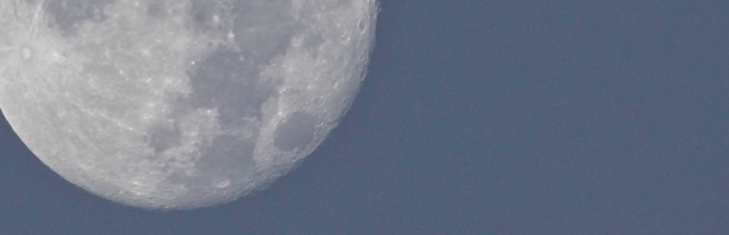

# Appendix A: DREAM Works - Model Code Basics and Data Structure

---
## A.1 Compilation on your system
Now The primitive equations and the semi-implicit timestep
DREAM solves the primitive equations expressed in terms of vorticity and divergence. These are written down in Hoskins and Simmons (1975, HS75) but let’s deciphier this presentation by approaching  them from the momentum equations, using subscript notation for partial derivatives:

$$
   \begin{eqnarray}
      u_t - fv &=& -uu_x - vu_y -wu_z - p_x/\rho \label{eqA1} \\
      v_t + fu &=& -uv_x - vv_y -wv_z - p_y/\rho \label{eqA2}
   \end{eqnarray}
$$

then,

$$
   \begin{equation}
      \partial/\partial x (A2) - \partial/\partial y (A1)
   \end{equation}
$$
