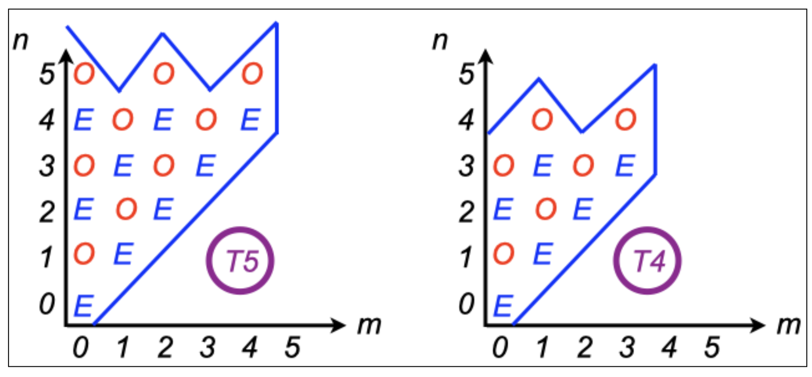

# Appendix A: DREAM Works - Model Code Basics and Data Structure

---
## A.1 Compilation on your system
Now The primitive equations and the semi-implicit timestep
DREAM solves the primitive equations expressed in terms of vorticity and divergence. These are written down in Hoskins and Simmons (1975, HS75) but let’s deciphier this presentation by approaching  them from the momentum equations, using subscript notation for partial derivatives:

$$
   \begin{eqnarray}
      u_t - fv &=& -uu_x - vu_y -wu_z - p_x/\rho & \qquad\qquad (A1) \\
      v_t + fu &=& -uv_x - vv_y -wv_z - p_y/\rho & \qquad\qquad (A1) \\
   \end{eqnarray}
$$

then,

$$
   \begin{equation}
      \dfrac{\partial}{\partial x} (A2) - \dfrac{\partial}{\partial y} (A1)
   \end{equation}
$$
gives the vorticity equation:

$$
   \begin{equation}
      \xi_t + f D + \beta v = -u\xi_x - v\xi_y - \xi D - (wv_z + p_y/\rho)_x + (wu_z + p_x/\rho)_y
   \end{equation}
$$
which leads to an equation for the tendency of absolute vorticity:

$$
   \begin{equation}
      \frac{\partial\zeta}{\partial t} = \frac{\partial}{\partial x} \{-u\zeta - wv_z - p_y/\rho\} - \frac{\partial}{\partial y} \{-v\zeta - wu_z - p_x/\rho\}
   \end{equation}
$$

The terms in curly brackets can be designated by the vector $(F_u,F_v)$ and this vorticity equation is the curl of this vector. Likewise the tendency of the divergence  can be deduced from the momentum equations:

$$
   \begin{equation}
      \dfrac{\partial}{\partial x} (A1) - \dfrac{\partial}{\partial y} (A2)
   \end{equation}
$$
eventually leading to a divergence equation as another expression in $F_u$ and $F_v$  with an added source related to the kinetic energy.

$$
   \begin{equation}
\frac{\partial D}{\partial t} = \frac{\partial}{\partial x} F_u + \frac{\partial}{\partial y} F_v - \frac{1}{2}\nabla^2(u^2 + v^2).
   \end{equation}
$$

These equations are written in sperical coordinates in HS75 and thermodynamic, continuity and hydrostatic equations are added in sigma vertical coordinates as shown in fig. A1. Also shown in Fig. A1 are some of the variable names used in the model for these terms: spectral variables in blue and grid point variables in red. In these equations $T'$ is a temperature deviation from a reference value which in DREAM is just set to 250K, $p*$ is the surface pressure, which in DREAM is calculated as the mean sea level pressure, and $\phi$  is the geopotential. The divergent part of the flow, expressed in equations 2-5 in fig. A1, can be written in summary form as a set of tendencies generated by flux convergences and other source terms. Eliminating for the divergence $D$ gives a wave equation in  with a source term. The semi-implicit time stepping approach is used to filter these gravity waves, by discretising this equation so that  the wave equation operator acts on the centred average divergence $\overline{D}$ , effectively filtering the fast gravity modes and allowing a longer time step. This development is summarised in fig. A2, including some more variable names from the code.

_Fig. A1: The primitive equations as presented in HS75._

_Fig. A2: Some more equations culled from HS75, outlining the semi-implicit timestep._

---
## A.2 Spectral truncation and data organisation
The model proceeds by calculating tendencies and then applying these tendencies to the model state to find the next model state using a semi-implicit centred difference timestep. Linear calculations for the tendencies are carried out directly in spectral space. Spatial derivatives are calculated as part of the transformation between spectral and grid space. Nonlinear advective terms are calculated in grid space. Model state variables therefore have both spectral and gridpoint arrays asigned to them, and in this section we will briefly outline how this data is organised. 

Model variables are projected onto Fourier transforms in the zonal direction and Legendre polynomials in the meridional direction. 

$$
   \begin{equation}
      X = \sum X^m_n P^m_n(\mu)e^{im\lambda}
   \end{equation}
$$

where $m$ is the zonal wavenumber, and n is the meridional wavenumber (i.e. the number of zeros between the poles). The number of coefficients is limited by a “jagged triangular” truncation, which has the property of istoropy on a sphere (the resolution independent of direction or latitude), and equal numbers of even and odd coefficients with respect to symmetry about the equator, in total and also individually for each zonal wavenumber. This is illustrated in fig. A3 which shows how many coefficients you have for triangular truncation to an odd number, T5 and an even number T4. DREAM can easily be run at T31 or T42.

_Fig. A3: Jagged triangular truncation for spectral coefficients._

For each model level, these complex coefficients are stored in increasing values of the meridional index n, embedded within increasing values of zonal wavenumber m. But this is done separately for even and odd coefficients. So for example, referring to fig. A3, the divergence, temperature and pressure variables at T5 would be stored in the following order: EEE,EE,EE,E,E,OOO,OO,OO,O,O. This data organisation makes it easy to create a state that is symetric about the equator: you just set all the odd coefficients (the second half of the binary record) to zero. This works because these fields are naturally symmetric about the equator (one does not expect divergence or temperature to change sign on the eqator). To make it work in the same way for the absolute vorticity, which is naturally antisymmetric, the vorticity coefficients are stored in the oppostie order: OOO,OO,OO,O,O,EEE,EE,EE,E,E. The jagged triangular truncation also provides a rapid way to impose cyclic symmetry in the zonal direction by selecting m as a  multiple of the order of symmetry desired. Six-fold symmetry was used in the original baroclinic wave lifecycle experiments (Simmons ans Hoskins, 1978), but this feature has not yen been used with DREAM. 

When the model variables are transformed to grid space they are stored on a Gaussian grid in latitude pairs, closing in towards the equator from the most polar latitudes to the most equatorial. There are MG equally spaced longitude points around the globe, with the first one situated on the Greenwich meridian. And there are JG different latitudes in each hemisphere, situated between the pole and the equator. Grid data is written for a given level in the following order: 

* first latitude pair:
`j=1 (north): i=1,MG, 0,0, j=JGG (south): i=1,MG,0,0``
* second latitude pair
`j=2 (north): i=1,MG, 0,0, j=JGG - 1 (south): i=1,MG,0,0``
* and so on until final latitude pair (closest to the equator)
`j=JG (north): i=1,MG, 0,0, j=JG + 1 (south): i=1,MG,0,0`.

Note that the total number of latitudes JGG=2JG, and two dummy zeros are written per latitude so the longitiude index in the array is actually MGG=MG+2. 

Gridpoint operations are carried out one latitude-pair at a time for all levels. So at any given moment only one latitude pair exists in grid space. The calculations proceed in zonal-vertical  slices. Note that in some routines the data is in grid space in the meridional direction but in Fourier coefficients in the zonal direction. At this stage the data is still complex, but when the data is fully into grid space it is real. Real grid data shares array space in common blocks with hybrid latitude-Fourier data, so declarations can change from one subroutine to another with the same variable names. Eeek !

