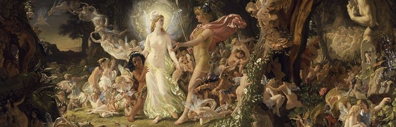

# Chapter 5: A Midsummer Night’s Dream - Working Together

We hope that this manual provides you with a way into using DREAM, and that you find it is more than a user guide, also a source of scientific ideas for your diagnostic modelling. At the time of writing I think it would be a bit of an exaggeration to talk about a DREAM “community”, but there is a loose affiliation of people who have used the model in one form or another. In [Appendix E](https://dreamusermanual.readthedocs.io/en/latest/AppendixE.html) there is a list of publications that have used DREAM or its earlier variants, and hopefully this list will continue to grow. To keep in touch, and participate in our ongoing activity there are some collaborative resources in place. 

## The DREAM GitHub repositories
It's here: [https://github.com/dream-gcm](https://github.com/dream-gcm)

This is where you have downloaded the code. It also hosts the DREAM web site, which is occasionally updated with the latest ongoing science. Also check on this web site for the latest contact information. Various other resources are also available on GitHub including some python code for generating plots, not covered in this user guide. 

## Slack channel
If you want to join the slack group ([https://dream-fcq1579.slack.com](https://dream-fcq1579.slack.com)), contact us via the web site and we’ll let you in. It’s a more dynamic and open ended way to collaborate than posting issues on GitHub or just exchanging emails. At this point, where the numbers involved are quite manageable, all means of communication are welcome. 

## Copyright, credit and collaboration
Downloading and using DREAM implies that you accept the copyright and terms of use of the GNU General Public License. Further to this, we request that users of DREAM proceed in a collaborative way. As well as the simple courtesy of recognising the effort put into development, a more collaborative approach is more productive for everyone concerned. Methods of using DREAM, and problems encountered are best discussed within the DREAM community, and as such they can be addressed far more effectively. This doesn’t mean that everyone has to be involved in everything all the time. That would be grossly inefficient. But there is a risk that an individualistic (or even in one instance unauthorised) use of the model can (and did) lead to mediocre science. We are stronger together, and we can help and inspire one another. So whatever you do, keep in touch, and give credit where it is due.